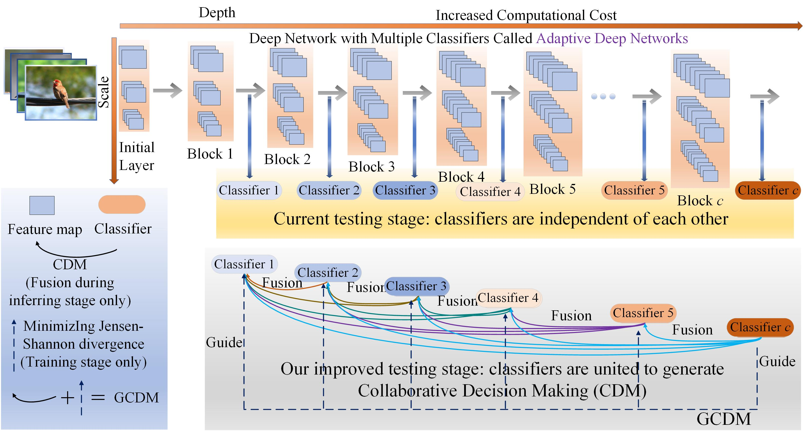
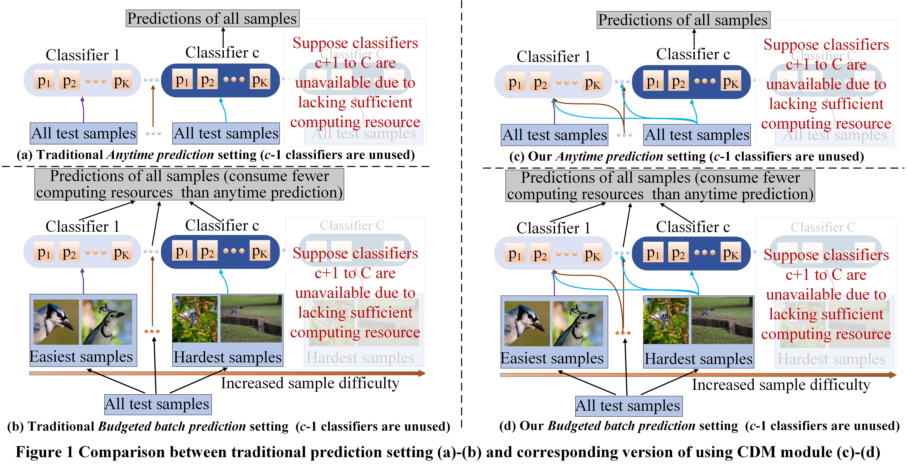
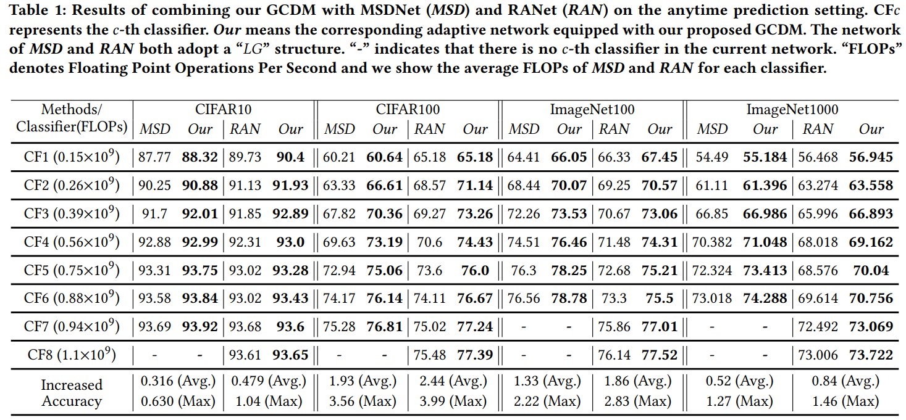

# Guided Collaborative Decision Making (GCDM) framework for improving Adaptive Deep Networks 
Our experimental environments involve Pytorch 1.12.1 and Numpy 1.22.4.

## Reproducing Paper Results
(1) Create a "data" folder and place the downloaded CIFAR10, CAIFAR100, ImageNet100, ImageNet1000 datasets into it. (2) Customize the parameters in "main_CIFAR_train.py" or "main_ImageNet_train.py" and run to train the adaptive network RANet based on the GCDM framework. (3) Run "main_CIFAR_test.py" or "main_ImageNet_test.py" and apply our proposed CDM module during inference to improve the accuracy of classifiers based on different computational resource, reproducing the results in the paper across various datasets.
  
## GCDM Framework

## Prediction Tasks of Adaptive Deep Networks Equipped with GCDM

## Improved Performance after Applying GCDM Framework for Popular Adaptive Deep Networks. 

