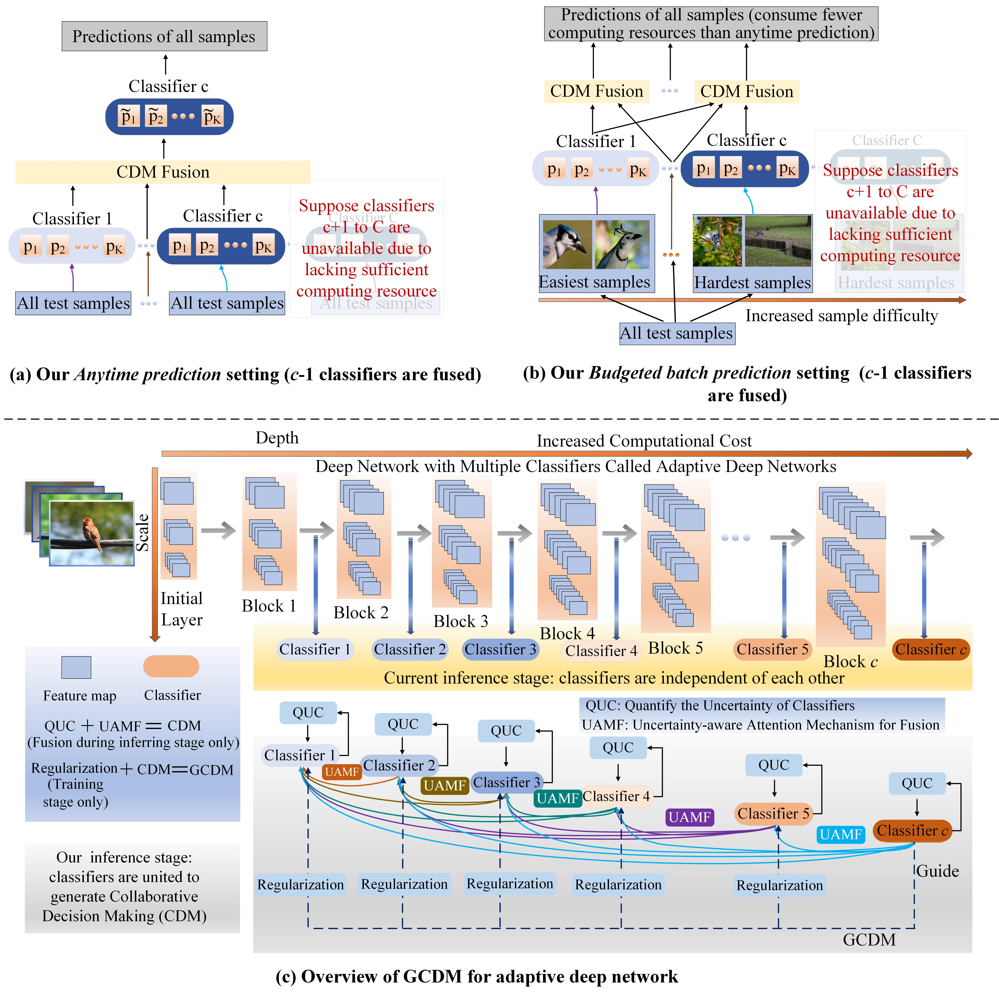

# GCDM (Guided Collaborative Decision Making)
This repo provides official code for the paper "Enhancing Adaptive Deep Networks for Image Classification via Uncertainty-aware Decision Fusion" publised in ACM Multimedia 2024. 
The full version paper is available at the [link](https://arxiv.org/abs/2408.13744).

## Key words: image classification, fusion, ensemble learning, adaptve deep networks, multi-head classifiers

## Method Framework

## Results on Anytime Prediction Setting

## Reproducing Paper Results
(1) Create a "data" folder and place the downloaded CIFAR10, CAIFAR100, ImageNet100 and ImageNet1000 datasets into it.  
(2) Customize the parameters in "main_CIFAR_train.py" or "main_ImageNet_train.py" and run to train the RANet based on the GCDM framework.  
(3) Run "main_CIFAR_test.py" or "main_ImageNet_test.py" and apply our proposed CDM module to reproduce the results in the paper across various datasets.

  

